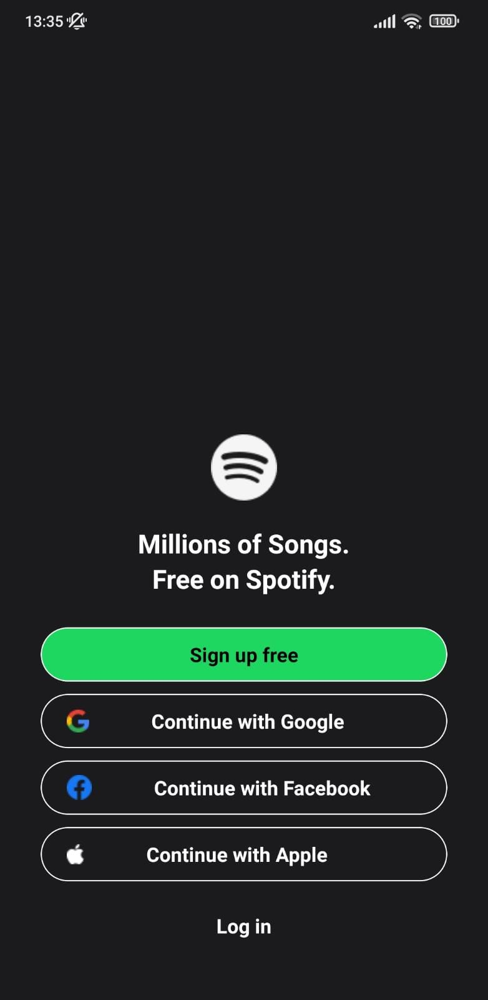
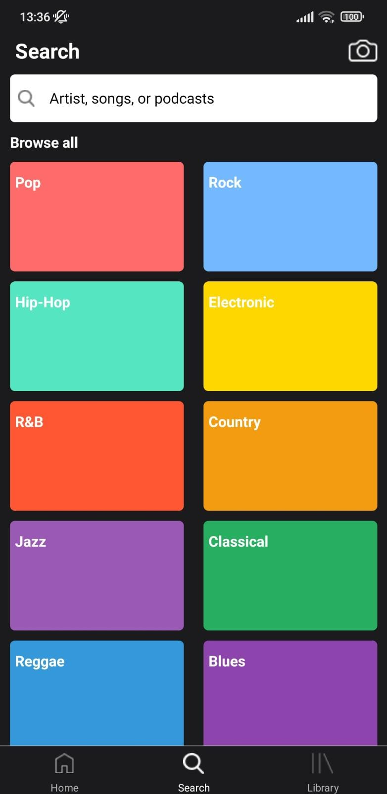
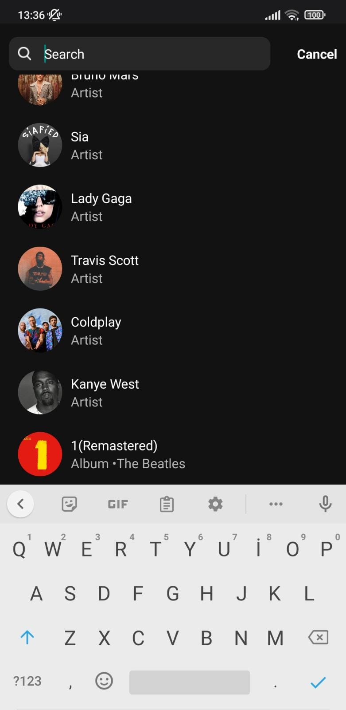

# SpotifyUI Clone Project


## Overview

Welcome to the SpotifyUI Clone project! This repository showcases a visual clone of the Spotify mobile app's user interface. The main focus of this project is to demonstrate a visually appealing design, while also implementing basic functionality for certain interactive elements.

## Project Preview

<div style="display: flex; flex-direction: row;">
  
  
  
</div>

## Outdated Design Notice

Please note that the design showcased here is a bit outdated and might not reflect the most current state of the Spotify's design. The Spotify has undergone changes since then to improve its visual appeal and functionality.

You can still access the original design on [Figma](https://www.figma.com/community/file/1052832340031141040)


## Features

- Recreated the modern and sleek UI design of Spotify.
- Implemented interaction for select buttons to showcase functionality.
- Smooth navigation between different app screens.
- Responsively designed for various screen sizes.

## Getting Started

To run this project locally, follow these steps:

1. **Clone the repository:**

   ```bash
   git clone https://github.com/AtakanAlkn/SpotifyUI-ReactNative.git

   
2. **Navigate to the project directory:**
   
   cd SpotifyUI-ReactNative


2. **Install dependencies:**
   
   npm install
   or
   yarn install


3. **Start the development server:**

   npm start
   or
   yarn start

   
4. **Run on iOS or Android:**

   To run the app on iOS or Android simulators/emulators, use the following commands respectively:

   npm run ios
   npm run android
   or
   yarn ios
   yarn android
   
**Congratulations!**
You've successfully set up and started the project locally. Feel free to explore the code, make changes, and test new features.

**Troubleshooting**
If you encounter any issues during the setup process or while running the app, consider the following steps:

Double-check that you've correctly configured your environment variables in the .env file.
Ensure you have Node.js and npm (or yarn) installed on your system.
Make sure you have Xcode (for iOS development) or Android Studio (for Android development) properly set up.
Clear the npm or yarn cache and node_modules directory, then run the installation step again.
If the problem persists, please open an issue on our GitHub repository. We'll be glad to assist you!

**License**
This project is licensed under the **MIT License.**


